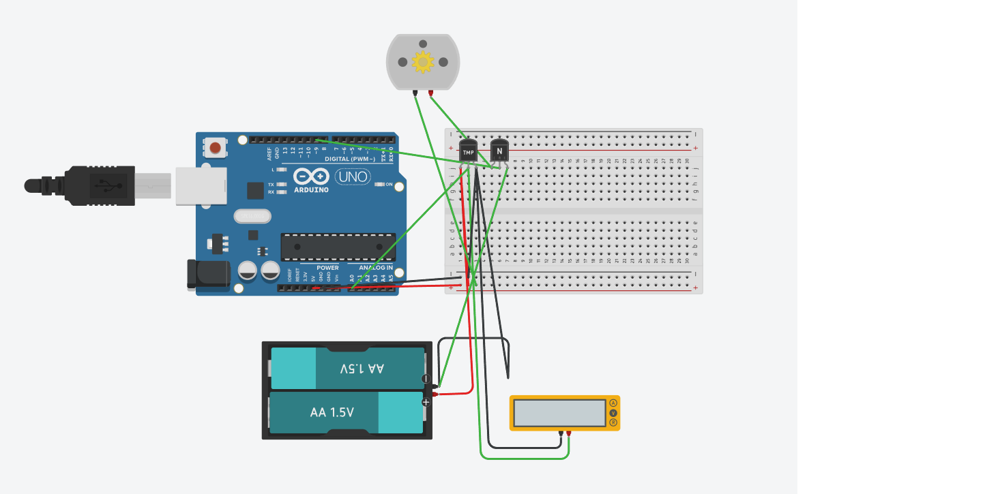

# Smart Thermal Management System with Hysteresis Control

## Overview
This project demonstrates an embedded system designed to control a high-current DC cooling motor based on real-time temperature data. The core focus of this project is the integration of **Embedded C++ Logic** with **Power Electronics (BJT Switching)** and the implementation of a **Hysteresis (Deadband) Control Algorithm** to ensure hardware longevity.

## Hardware Components
* **Microcontroller:** Arduino Uno (ATmega328P)
* **Sensor:** TMP36 Temperature Sensor (Analog)
* **Power Switch:** NPN Transistor (BJT)
* **Actuator:** DC Motor (Cooling Fan Simulation)
* **Power Supply:** Independent dual-power setup (5V Logic, External Battery for Motor)

## Key Engineering Principles Applied
1.  **Analog-to-Digital Conversion (ADC):** Processing continuous voltage signals from the TMP36 sensor into 10-bit digital values, and mathematically converting them back to Celsius.
2.  **Power Electronics & Load Isolation:** Safely driving a high-current DC motor using an NPN transistor. The microcontroller only provides a low-current base signal, preventing board damage while switching a heavier external load.
3.  **Hysteresis Control (Chattering Prevention):** Implemented a deadband logic in C++. 
    * Turn `ON` threshold: > 31.0 °C
    * Turn `OFF` threshold: < 30.0 °C
    * *Why?* This approach prevents the motor from rapidly turning on and off around a single setpoint, eliminating mechanical stress, protecting the transistor from overheating, and avoiding repeated inrush current spikes.

## Circuit Design

- The motor is powered by an independent power source.
- Grounds (GND) are shared to ensure a common reference point.
- The transistor acts as a low-side switch.
